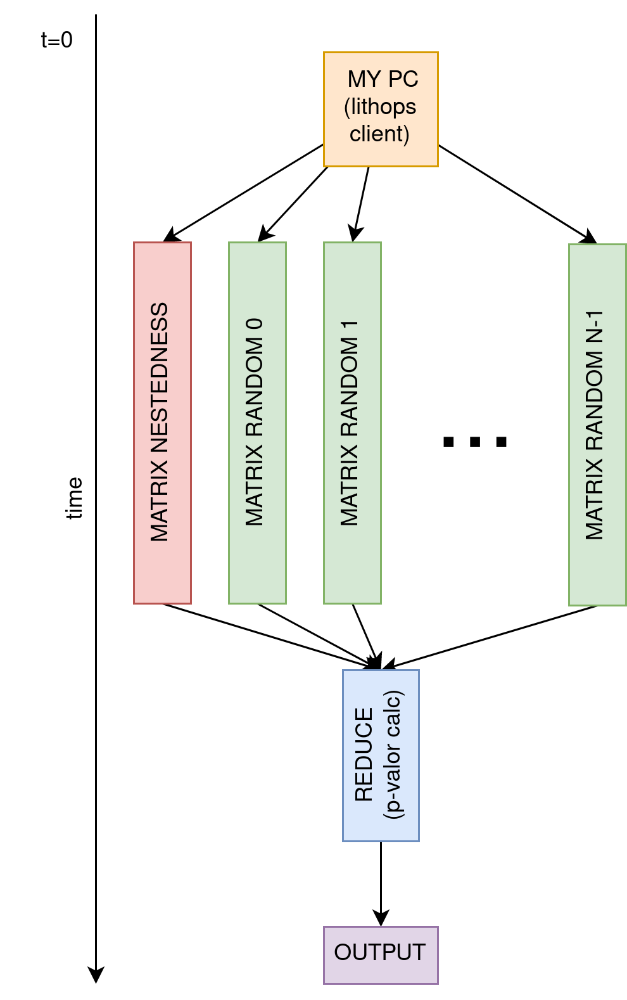

# Nestedness sobre Lithops
## Configuración del entorno
Para ejecutar el algoritmo nestedness sobre Lithops, por favor, instala los siguientes paquetes de Python.
```bash
pip install pandas
pip install lithops
```

## Ejecutar el algoritmo
```bash
python3 main.py ../input_files/count_Genus_all.tsv ../input_files/metadata.csv ../input_files/sp_code.txt <set_type> <num_random_matrices>
``` 

## Ventajas de Lithops para el algoritmo nestedness
Nótese como este algoritmo encaja perfectamente dentro de la filosofía de computación paralela map-reduce. En dicha modalidad,
1.  Un conjunto de tareas paralelas se ejecutan sin comunicarse entre ellas (*fase map*), para que 
2. todos los resultados de dichas tareas se agregen (*fase reduce*) y se obtenga el resultado final deseado.

El algoritmo nestedness se modifica para que cada una de las matrices computadas ($N$ matrices, compuestas de: $1$ matriz nestedness y $N-1$ matrices random) se procesen en paralelo. Como no hay dependencias durante su procesamiento, se trata de un caso de *embarrasing parallelism* donde la adaptación del algoritmo de su versión secuencial a su versión paralela apenas requiere modificar unas pocas líneas de código. Una vez todas las matrices son computadas, la función de reduce se encargará de calcular el p-valor.

Se puede ver un diagrama explicativo aquí:


<p align="center">

</p>


## Escalado del algoritmo
Actualmente, Lithops se ha configurado para ejecutarse sobre el equipo local, luego se crearán tantos procesos en nuestro host como matrices se hayan de computar. Esto paralelizará hasta alcanzar en número de CPUs del host, momento al partir del cual la asignación proceso-CPU se empezará a degragar y se alcanzará un techo de escalado.

Para superar esta limitación, se propone utilizar un configurar un compute backend de Lithops tipo serverless. Utilizar FaaS nos permitirá, por ejemplo, poder hacer una ejecución del algoritmo con número de matrices $N=1000$ donde cada proceso tendrá su asignación de CPU exclusiva. 


 

